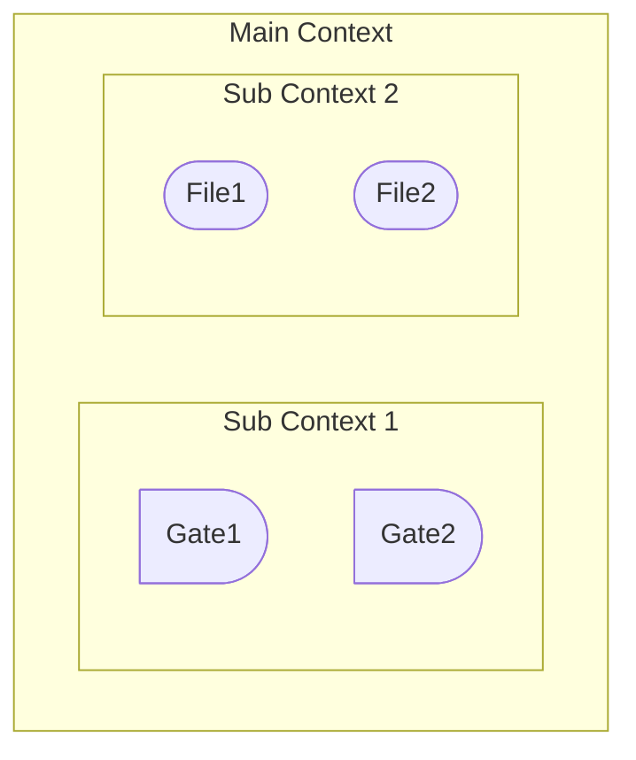
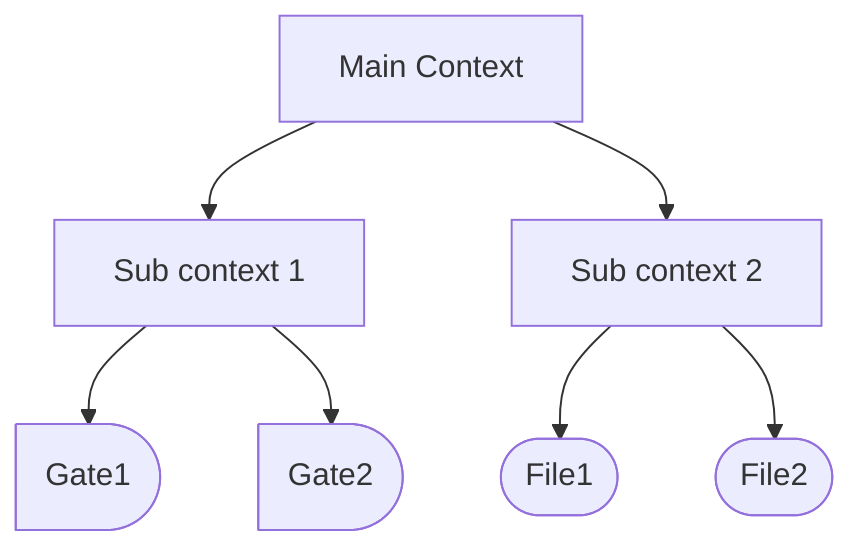

## Principe

```mermaid
flowchart TD
	subgraph "Main Context"
		subgraph "Sub Context 1"
			gate1@{ shape: delay, label: "Gate1"}
			gate2@{ shape: delay, label: "Gate2"}
		end
		subgraph "Sub Context 2"
			file1([File1])
			file2([File2])
		end
	end
```

## Event redirection
ex. A mouse click, Scroll, drag, ...

```mermaid
flowchart TD
	main[Main Context]
	subCtx1[Sub context 1]
	subCtx2[Sub context 2]
	
	gate1@{ shape: delay, label: "Gate1"}
	gate2@{ shape: delay, label: "Gate2"}
	
	file1([File1])
	file2([File2])
	
	main --> subCtx1
	main --> subCtx2
	
	subCtx1 --> gate1
	subCtx1 --> gate2

	subCtx2 --> file1
	subCtx2 --> file2

```

